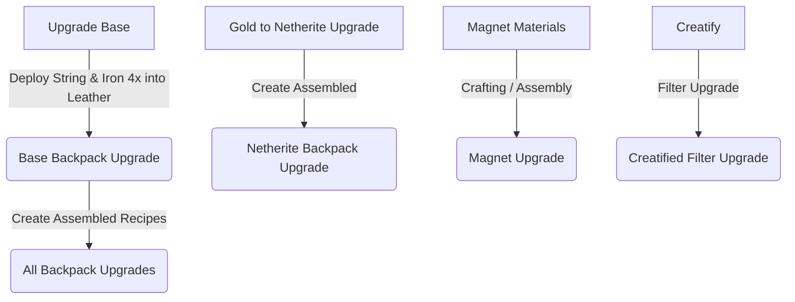

# PEAK dev Modpack - Master Development Backlog

This backlog catalogs the complete set of development notes, testing requirements, progression adjustments, recipe modifications, and balance tweaks for the **PEAK dev** modpack. No implementation work has been executed yet, as per user direction. This document serves as the single source of truth for the upcoming development cycles.

---

## 📋 1. Testing & Diagnostics

Items that require validation, performance testing, or runtime behavior checks.

| Target Item | Description / Action Required | Status |
| :--- | :--- | :---: |
| **Lootbeams** | Perform comprehensive testing on loot beam rendering, visibility, and color-coding. | `[ ] Pending` |
| **Loottables** | Test custom loot tables across chests, structures, and drops to ensure items spawn correctly. | `[ ] Pending` |
| **Mob Properties Randomness** | Validate random mob properties, attributes, and equipment scaling configurations. | `[ ] Pending` |
| **Better Third Person** | Run checks to verify third-person camera physics, transitions, and compatibility. | `[ ] Pending` |
| **Perception** | Check mod integration, rendering, or specific features related to perception/vignettes. | `[ ] Pending` |
| **Random Gateways Spawning** | Verify behavior, spawn rates, and locations of random gateways spawning in the world. | `[ ] Pending` |
| **Rain Lag** | Conduct performance tests specifically targeted at rain-related lag and FPS drops. | `[ ] Pending` |
| **Netherite Helmet Enchanting** | Investigate why the Netherite Helmet is not enchanting properly. Check mod compatibility and values. | `[ ] Pending` |
| **All Enchantments Audit** | Conduct a thorough check of all enchantments in the pack to ensure they apply and scale correctly. | `[ ] Pending` |

---

## 🏆 2. Questing & Progression

Core progression mechanics, tier gates, and questline balancing.

> [!IMPORTANT]
> **Automatic World Tier Progression** is a high-priority system design requirement!

- [x] **Knight Quest Tuning & Fixing:**
  - Fine-tune parameters, reward tables, and stage requirements for the knight quests.
  - Fix any broken progression triggers.
- [ ] **Vampirism Tunes:**
  - Investigate and adjust balance/tunes for the Vampirism mod.
- [x] **Automatic World Tier Progression:**
  - Design and implement a fully automated world tier progression mechanic to gate content dynamically.
- [ ] **Adjust Level Limit (Dynamic Difficulty):**
  - Adjust and configure the max level limit/scaling of the Dynamic Difficulty system.
- [ ] **World Tier Haven Uncommon Enemy Spawns:**
  - Fix spawn rates in the Haven world tier; currently it is not spawning enough uncommon enemies.
- [x] **Paraglider Spirit Orb Acquisition Overhaul:**
  - **Goal:** Spirit Orbs should *not* be obtainable via chest loot or regular drops.
  - **New Mechanic:** Can only be obtained by breaking spawners very rarely.
  - **Tuning:** The rarity must be calibrated such that the player has to break almost a thousand spawners to achieve maximum health bars.

---

## ⚙️ 3. Mod Configuration & Integration

Dependencies, duplicate removal, and configuration tweaks.

- [x] **Check Cerulean:**
  - Run diagnostic checks on Cerulean library integration or dependencies.
- [ ] **Forgified Fabric Removal:**
  - Remove Forgified Fabric libraries/dependencies completely. Ensure no mixin or load-time crashes occur.
- [ ] **Nowheel Check:**
  - Check the `nowheel` mod/setting or behavior.
- [ ] **Extensible Enums:**
  - Check/investigate implementation of extensible enums for mod compatibilities.
- [x] **Configure Ore Generation (Duplicate Cleanup):**
  - **Issue:** Multiple mods are generating duplicate ores in the world.
  - **Action:** Configure ore gen rules to unify ore types, leaving only one version of each ore (e.g., copper, tin, silver) generating in the world.
- [ ] **Distant Horizons Options Crash (Tombstone & SimplyTooltips Conflict):**
  - **Issue:** Opening DH options on the main menu crashes the client because Tombstone's server config is queried by SimplyTooltips before NeoForge loads it.
  - **Workaround:** Currently disabled via `showDhOptionsButtonInMinecraftUi = false` in `DistantHorizons.toml`.
  - **Action Required:** Correct this properly (e.g., update mods, report conflict, or investigate SimplyTooltips / Tombstone load-safe config adjustments) so the button can be re-enabled.

---

## 🎨 4. Visuals & Textures

Fixes to assets, tooltips, and rendering.

> [!WARNING]
> Visual immersion is key to premium aesthetic polish. Fixing missing textures is a top priority.

- [ ] **Ring of Spellblade Affinity Texture Fix:**
  - **Issue:** The Ring of Spellblade Affinity from *Iron's Spells 'n Spellbooks* is missing its item texture.
  - **Action:** Restore or map a valid texture asset for this item.
- [ ] **Adjust Obscure Tooltips 3D Preview Restriction:**
  - **Current Behavior:** 3D tooltips preview everything.
  - **Desired Behavior:** Limit the 3D preview tooltips to only work on specific, premium armor sets (e.g., Fantasy Armor, Immersive Armor, Dragonsteel from Ice and Fire, etc.).

---

## 🧪 5. Balance & Mechanics

Economy, jewelry, entities, and specialized enchanting systems.

- [ ] **Limit Attack Range:**
  - Configure or script limits on players' or mobs' attack ranges to prevent exploits and improve combat flow.
- [ ] **Buff the Wither:**
  - Increase Wither stats, abilities, or drops to make it a more challenging and rewarding mid-to-late game boss.
- [ ] **Obsidilith Buff:**
  - Obsidilith is currently too weak. Buff its health, attack damage, or special mechanics to align with its tier.
- [ ] **Fix Excess Mob Drops:**
  - Mobs are dropping too many items. Adjust loot tables and drop quantities to prevent inventory clutter and economy inflation.
- [ ] **Rebalance Gems & Jewelry:**
  - Evaluate stat bonuses, drop rates, and crafting costs of gems and jewelry items to ensure balanced progression.
- [ ] **Tome of Alkahestry Balance Review:**
  - **Question:** Is the Tome of Alkahestry (from *Reliquary Reincarnations*) balanced for the pack's economy? Review and adjust if necessary.
- [ ] **Create Machine Enchants restrictions:**
  - **Design:** Restrict machine-oriented enchants (or specialized enchants) so they can only be applied using high-level enchanting setups(apoth enchants).

---

## 🛠️ 6. Recipes & Crafting Integrations (Create-focused)

Custom recipes and multi-step deployment assemblies for backpacks and upgrades using the *Create* mod.

### 🧪 Recipe Overhauls & Removals
- [x] **Hallowed Gold Recipe Clean-up:**
  - **Issue:** The Create mixing recipe for Hallowed Gold does not make sense.
  - **Action:** Remove the Create mixing recipe completely; keep only the *Malum* custom recipe.

### 🎒 Create Assembled Backpack Upgrades
- [ ] **Upgrade Base Recipe:**
  - **Recipe:** Deploying string and iron **4 times** into leather.
- [ ] **Backpack Upgrade (Gold ➔ Netherite):**
  - **Recipe:** Convert this upgrade into a multi-step Create assembled recipe.
- [ ] **Magnet Upgrade:**
  - **Recipe:** Crafting should require actual magnetic materials to align with realism.
- [ ] **Unify Upgrades:**
  - **Action:** Make **all** backpack upgrade recipes use Create assembly lines.
- [ ] **Filter Upgrade:**
  - **Action:** Create a "Creatified" custom Filter Upgrade assembly recipe.

### new notes
- Rework dragon armour toughness and recipe
- add armour and equipment from remaining mods (alex mobs,etc)
- elite control circuit recipe doesnt make sense
- make everlasting backpack upgrade cost heart canisters?
- make sure that draconic evolution recipes make sense.
- rework weapon attack range (maybe figure out why do they attack so far away and why are they unbreakable)
- [x] rework ore worldgen to eliminate duplicated ores from spawning
- remove atlas map mod sinsce ftb map is installed